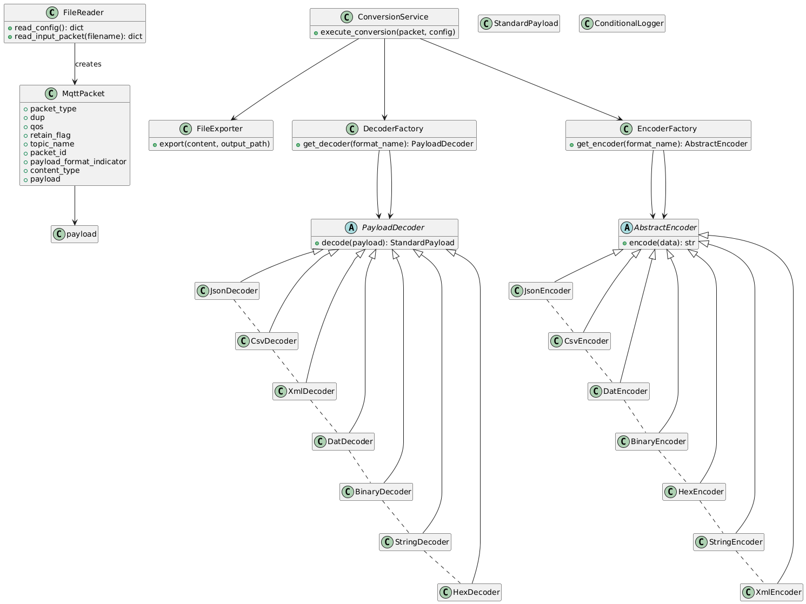
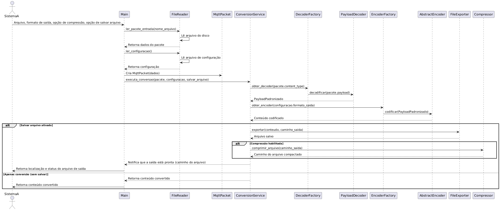

# Arquitetura do Sistema – FileConverter-CSI22

## Visão Geral

O **FileConverter-CSI22** é um sistema middleware desenvolvido para conversão de payloads de pacotes MQTT entre diferentes formatos de dados, incluindo JSON, XML, CSV, DAT, Binário, Hexadecimal e String. Seu objetivo é garantir a interoperabilidade entre dispositivos heterogêneos em redes IoT, sistemas distribuídos e ambientes corporativos.

O sistema é projetado com base em princípios de **Programação Orientada a Objetos (POO)** e faz uso extensivo de **Padrões de Projeto**, assegurando modularidade, extensibilidade, manutenção facilitada e clareza na organização do código.

---

## Estrutura de Componentes

O projeto é organizado nas seguintes pastas principais:

```
mqtt_converter_project/
├── main.py                
├── config/                
├── input/                 
├── output/                
├── src/                   
│   ├── core/              
│   ├── decoder/           
│   ├── encoder/           
│   └── utils/             
└── tests/                 
```

---

## Arquitetura do Sistema

### 🔹 Componentes Principais

| Componente         | Descrição                                                                                   |
|--------------------|----------------------------------------------------------------------------------------------|
| **FileReader**     | Lê arquivos de configuração e de entrada (pacotes MQTT).                                    |
| **MqttPacket**     | Modelo que representa um pacote MQTT, contendo metadados e o payload.                       |
| **DecoderFactory** | Cria instâncias dos decodificadores adequados ao formato de entrada.                        |
| **EncoderFactory** | Cria instâncias dos codificadores de acordo com o formato de saída.                         |
| **PayloadDecoder** | Interface abstrata para decodificadores (`decode(payload) → StandardPayload`).              |
| **AbstractEncoder**| Interface abstrata para codificadores (`encode(data) → str`).                               |
| **ConversionService** | Orquestra o processo completo de conversão de payload.                                   |
| **FileExporter**   | Salva o payload convertido em um arquivo `.txt` (UTF-8).                                     |
| **Compressor**     | Realiza compressão opcional dos arquivos gerados (ZIP).                                      |
| **ConditionalLogger** | Singleton para controle e registro de logs.                                              |
| **StandardPayload**| Estrutura intermediária (geralmente um `dict` ou `list`) usada na conversão.                 |

---

## Fluxo de Funcionamento

1. **Leitura de Configurações e Entrada**
   - O `FileReader` lê o arquivo JSON de configuração e o arquivo de entrada contendo o pacote MQTT.

2. **Criação do Objeto MqttPacket**
   - As informações do JSON de entrada são encapsuladas na classe `MqttPacket`.

3. **Decodificação**
   - O `ConversionService` solicita à `DecoderFactory` o decoder apropriado.
   - O decoder transforma o payload bruto em uma estrutura intermediária (`StandardPayload`).

4. **Codificação**
   - A `EncoderFactory` fornece o encoder correspondente ao formato de saída configurado.
   - O encoder transforma o `StandardPayload` em uma string no formato desejado.

5. **Exportação**
   - O `FileExporter` salva a string convertida em um arquivo `.txt` codificado em UTF-8.

6. **Compressão (Opcional)**
   - Caso habilitado, o `Compressor` gera um arquivo ZIP contendo o `.txt`.

7. **Logging (Opcional)**
   - Todas as ações são registradas pelo `ConditionalLogger` (Singleton).

8. **Uso como Biblioteca**
   - A função `convert_payload_to` permite uso externo retornando o conteúdo convertido.

---

## Padrões de Projeto Aplicados

| Padrão                  | Aplicação no Sistema                                                         |
|-------------------------|------------------------------------------------------------------------------|
| **Factory Method**       | Criação de decodificadores e codificadores.                                 |
| **Strategy**             | Estratégias de decodificação e codificação.                                 |
| **Facade**               | `ConversionService` encapsula toda a complexidade interna.                 |
| **Decorator** (parcial)  | Funcionalidades opcionais (compressão, logging) poderiam ser decorators.    |
| **Singleton**            | `ConditionalLogger` garante instância única.                                |

---

## Diagramas

### Diagrama de Classes


### Diagrama de Sequência


---

## Extensibilidade

O sistema é facilmente extensível. Para adicionar um novo formato:

1. Implementar:
   - Um `Decoder` (herda de `PayloadDecoder`).
   - Um `Encoder` (herda de `AbstractEncoder`).
2. Registrar na `DecoderFactory` e na `EncoderFactory`.

---

## Conclusão

A arquitetura do FileConverter-CSI22 prioriza modularidade, simplicidade de uso e facilidade de manutenção. A separação clara entre decodificação, codificação e serviços auxiliares permite não apenas o uso como aplicação, mas também sua integração como uma biblioteca em sistemas maiores.
